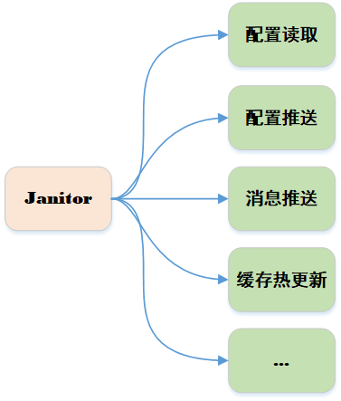
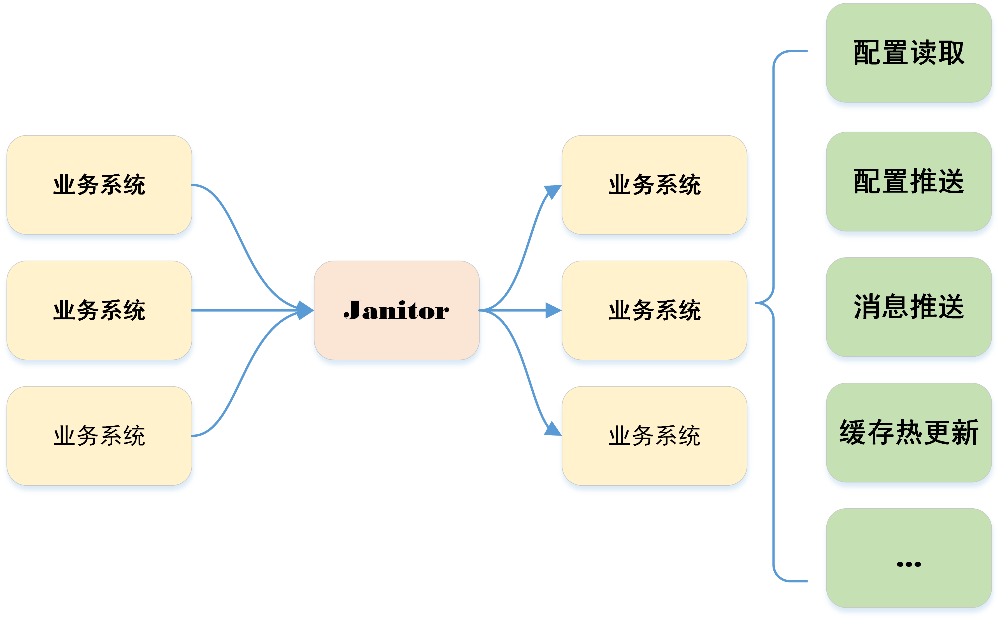
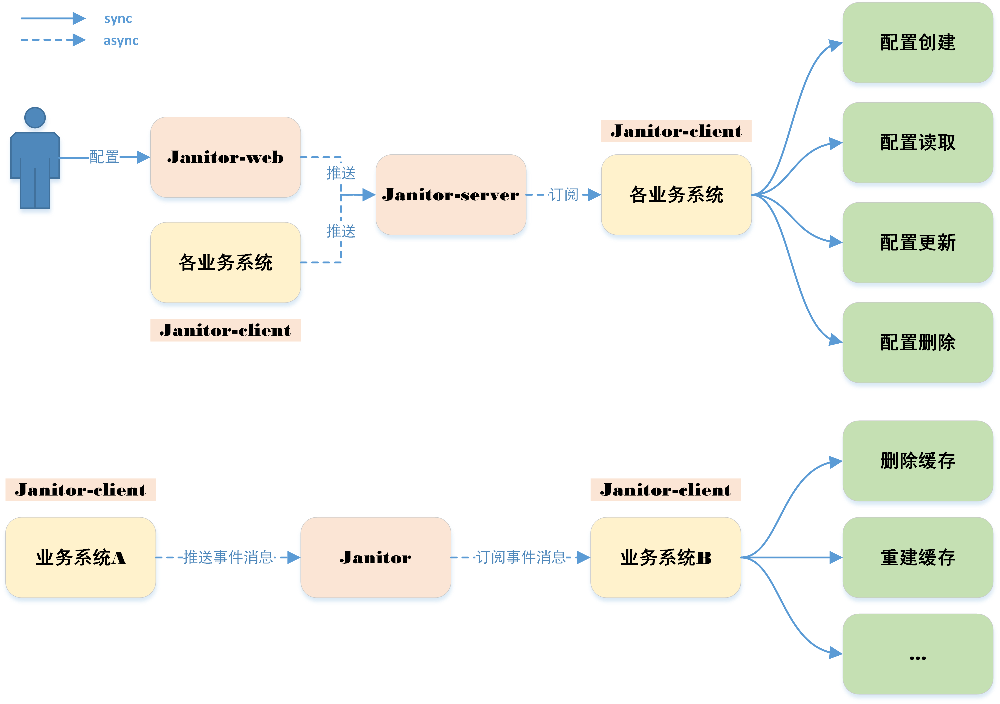
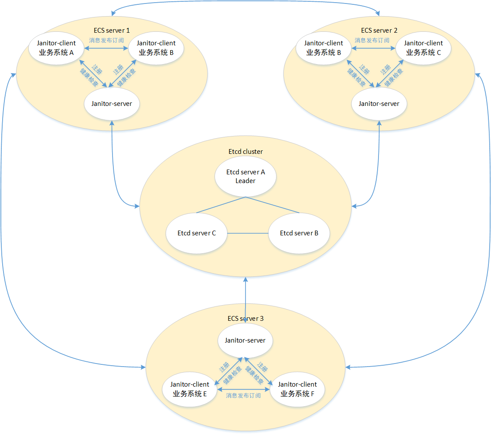

<p align="center">
  <a href="#"></a>
  <a href="https://gitee.com/LiangGuoQ/janitor"></a>
  <a href="https://gitee.com/LiangGuoQ/janitor"></a>
  <a href="https://github.com/LiangGuoQ/janitor"></a>
  <a href="https://github.com/LiangGuoQ/janitor"></a>
  <a href="https://github.com/LiangGuoQ/janitor-admin"></a>
  <a href="#项目交流"></a>
  <a href="#如何准备面试"></a>
</p>

## 项目介绍

janitor项目**核心功能**：统一的配置中心、事件推送，支持配置热更新，以及缓存热更新消息推送等应用场景


<p align="center"></p>


**项目出现意义**：只要公司内有配置热更新或者缓存热更新消息推送等的需求，都应该要有类似`janitor`的项目，对各业务系统的配置和事件消息进行统一发送处理。这有利于对功能的收拢，以及提高业务需求开发的效率





## 系统项目架构

janitor项目**核心流程**：`janitor-server`接收到客户端注册请求，直接将注册信息存进`Etcd`，再利用`Etcd`监听功能，实现配置、事件消息推送等功能。`janitor-server`监听`Etcd`消息后存入约定的文件，再由各`janitor-client`对配置或消息文件进行统一处理





## 项目部署架构图





## 使用姿势

目前引用的中间件教程的安装姿势均基于`Centos 7.6`，janitor项目**强依赖**`Etcd`。

##### **1**、安装`Etcd`

janitor使用的`Etcd`版本**3.5.0**，使用docker安装`Etcd`：

```shell
docker run -d --name etcd-server \
  --publish 2379:2379 \
  --publish 2380:2380 \
  --env ALLOW_NONE_AUTHENTICATION=yes \
  --env ETCD_ADVERTISE_CLIENT_URLS=http://etcd-server:2379 \
  bitnami/etcd:3.5.0;
```

进入etcd-server容器:

```shell
docker exec -it etcd-server /bin/sh
```

`Etcd`增加可以事件推送白名单（***后续规划通过管理后台界面配置***）：

```shell
# key：事件类型，value：事件类型下的应用白名单
etcdctl put janitor.whiteList '{"CACHE_EXPIRE":["client1","client2"]}' 
```

`Etcd`增加应用可以事件推送的目标名单（***后续规划通过管理后台界面配置***）：

```shell
# key：事件推送者，应用名称，value：事件推送的目标应用名称数组集合
etcdctl put janitor.triggerMap '{"client1":["client2"],"client2":["client1"]}'
```


##### **2**、运行`janitor-server`

拉取代码仓库最新代码

```shell
git clone https://gitee.com/LiangGuoQ/janitor.git
# or
git clone https://github.com//LiangGuoQ/janitor.git
```

直接进入`janitor-server`工程

填写`application.yaml`中`janitor.etcd`对应的`server/authority/user/password`信息，maven打包项目

```shell
cd janitor
mvn clean package install
```

运行`JanitorServer`的`main`方法


##### **3**、启动`janitor-client`

maven引入`janitor-client`依赖：

```tex
<properties>
    <janitor.version>1.0.0</janitor.version>
</properties>

<dependencies>
    <dependency>
        <groupId>com.janitor</groupId>
        <artifactId>janitor-client</artifactId>
        <version>${janitor.version}</version>
    </dependency>
</dependencies>
```

启动client1客户端，同理启动client2客户端，代码差不多，以下列举client1代码：

```java
/*
 * ConfigHelper:
 *      localPath：应用路径，存储事件文件、事件文件索引等，宿主机多个客户端应确保唯一
 *      app：客户端唯一标识
 *      configs：指定配置监听的etcd的key的前缀
 */
JanitorHelper janitorHelper = new JanitorHelper("/app/client", "client1", "client1");

janitorHelper
    // 添加事件监听器，指定event类型，当事件订阅到，可以在exec()处理自定义逻辑
    .addEventListener(
    new AbstractEventListener(3, 10, false) {
        @Override
        public void exec(String eventValue) {
            System.out.println("client1 收到消息：" + eventValue);
        }

        @Override
        public EventTypeEnums event() {
            return EventTypeEnums.CACHE_EXPIRE;
        }
    })
    // 添加配置监听器，当配置创建、读取、修改或者删除时，可以处理自定义逻辑
    .addProcessor(new ConfigProcessor() {
        @Override
        public void onLoad(Properties properties) {
            for (Object key : properties.keySet()) {
                System.out.println("client1 配置初始化： key：" + key + ", value：" + properties.get(key));
            }
        }

        @Override
        public void onAdd(Properties properties) {
            for (Object key : properties.keySet()) {
                System.out.println("client1 配置创建： key：" + key + ", value：" + properties.get(key));
            }
        }

        @Override
        public void onDelete(Properties properties) {
            for (Object key : properties.keySet()) {
                System.out.println("client1 配置删除： key：" + key + ", value：" + properties.get(key));
            }                    }

        @Override
        public void onUpdate(Properties properties) {
            for (Object key : properties.keySet()) {
                System.out.println("client1 配置更新： key：" + key + ", value：" + properties.get(key));
            }
        }
    })
    // janitor-server 服务的端口号
    .setJanitorServerHostPort("6237")
    // janitor-server 服务的ip地址
    .setJanitorServerIp("127.0.0.1")
    .start();
```


##### 4、配置测试

进入`Etcd`控制台，输入以下命令：

```shell
etcdctl put client1.testConfig janitor1
etcdctl put client1.testConfig janitor2
etcdctl del client1.testConfig
```

控制台输出：

```shell
client1 配置创建： key：client1.testConfig, value：janitor1
client1 配置更新： key：client1.testConfig, value：janitor2
client1 配置删除： key：client1.testConfig, value：janitor2
```

至此，配置的测试成功（***后续规划通过管理后台界面配置***）


##### 5、事件推送测试

client1代码增加：

```java
/*
 * client1往client2发送事件消息
 * send:
 *      eventType：事件类型，目前只实现CACHE_EXPIRE
 *      eventValue：事件具体内容，目标客户端可根据事件内容做具体业务逻辑
 *      targetAppNames：目标应用客户端，可以多个
 */
janitorHelper.send(EventTypeEnums.CACHE_EXPIRE, "我发了个事件通知", "client2");
```

控制台输出：

```
client2 收到消息：我发了个事件通知
```

至此，事件推送的测试成功

**PS：** 步骤（3、4、5）的代码可在`janitor-client`工程`com.janitor.client.test`下查看


## 里程碑

- [x] Maven+SpringBoot项目搭建
- [x] Logback日志记录项目运行时信息，引入common/Validation/Hutool/Lombok/Jackson/Httpasyncclient等工具包
- [x] Docker搭建Etcd，并接入Etcd，初始化Etcd操作类
- [x] 使用监听者+模板模式，实现配置接入，配置的初始化，创建，更新，删除等生命周期事件
- [x] 使用监听者+模板模式，实现事件消息推送与订阅
- [ ] janitor-web搭建，通过管理后台管理事件推送白名单、事件推送的目标业务系统、配置的在线创建修改等
- [ ] 接入日志系统
- [ ] 接入监控系统


## 项目交流

欢迎扫描下方二维码添加我的**个人微信**备注：【**项目**】，我会在空闲的时候拉进项目交流群（群里会解答相关的问题）


## 如何准备面试？

多读、多抄、多写。
